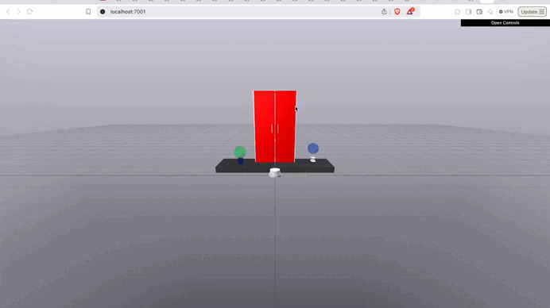

[](https://codecov.io/gh/kwesiRutledge/brom_drake-py)

# brom_drake-py
Brom is a helper library for the [Drake](https://drake.mit.edu/) robotics simulation and verification library.
Its goal is to simplify common debugging and testing activities in Drake (for example, logging the outputs
of systems in your block diagrams). 

Some of Brom's features:

Feature                    |  Code | Results
:-------------------------:|:-------------------------:|:-------------------------:
The Diagram Watcher (the `DiagramWatcher` will log + plot all output ports of your `Diagram` automatically) |`add_watcher_and_build()`| 
The Drake-ify feature (converts your URDF file into a form that Drake can consume) | `drakeify_my_urdf()` | 
Productions (partially complete robot scenarios to test your algorithms) | (See [Examples Directory](https://github.com/kwesiRutledge/brom_drake-py/tree/main/examples/productions) or [the Wiki](https://github.com/kwesiRutledge/brom_drake-py/wiki/Productions)) | 

To learn more, look through our documentation/Wiki [here](https://github.com/kwesiRutledge/brom_drake-py/wiki).

## Installation

`brom_drake` is available on PyPI and installable with pip:

```shell
pip install brom-drake
```

### Developer install

You can also install the package during local development by cloning
the repository and running the following commands from inside it:

```bash
pip install -r requirements.txt
pip install -e .
```

## Citation

Feel free to cite this project if it helped with your work!

```
@misc{bromDrake2024,
  author = "Kwesi Rutledge and the Wrench Robotics Team",
  title = "Brom: A Helper Library for the Drake Toolbox",
  year = 2024,
}
```

## FAQs

### Why the name Brom?

[Brom the storyteller](https://inheritance.fandom.com/wiki/Brom) is a character from the
[Inheritance](https://en.wikipedia.org/wiki/Eragon) series by Christopher Paolini.
He is a wise mentor that helps Eragon (the protagonist) master dragons. ;)


### How can I support this project?

Feel free to create an issue/send the Wrench Robotics team a message if you're interested in helping out!

## Related Work

Some other work in the open-source Drake community:
- [kinova_drake](https://github.com/vincekurtz/kinova_drake) - A Drake-based library that builds a 
  simple version of the manipulation station for the Kinova Gen3 robot arm.
  Also works with the hardware.
- [airo-drake](https://github.com/airo-ugent/airo-drake) - A python package meant to simplify
  working with Drake and the `airo-mono` repository from the AI and Robotics Lab at Ghent University.

## To-Dos

- [ ] Figure out how to tell if two systems are connected in Drake.
- [ ] Add support for abstract output ports?
- [ ] Add more readme explanations of what is going on under the hood.
- [ ] Create a method that makes each material in a URDF file have unique names if they have specific values
- [ ] Allow for the user to give "Drake-unfriendly" URDFs to `ShowMeThisModel` production
