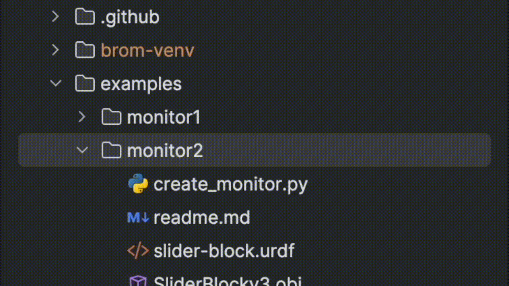

[](https://codecov.io/gh/kwesiRutledge/brom_drake-py)

# brom_drake-py
Brom is a helper library for the [Drake](https://drake.mit.edu/) robotics simulation and verification library.
Its goal is to simplify common debugging and testing activities in Drake (for example, logging the outputs
of systems in your block diagrams). 

Some of Brom's features:

Feature                    |  Code | Results
:-------------------------:|:-------------------------:|:-------------------------:
The Diagram Watcher (the `DiagramWatcher` will log + plot all output ports of your `Diagram` automatically) |`add_watcher_and_build()`| 
The Drake-ify feature (converts your URDF file into a form that Drake can consume) | `drakeify_my_urdf()` | 

(More coming soon...)

## Installation

`brom_drake` is available on PyPI and installable with pip:

```shell
pip install brom-drake
```

### Developer install

You can also install the package during local development by cloning
the repository and running the following commands from inside it:

```bash
pip install -r requirements.txt
pip install -e .
```

## Use Cases

Here are a few of the features available in `brom_drake` and how they work.

### Easily Log Your Diagram's Signals

It is recommended that you use the convenience function `add_watcher_and_build` to add a `DiagramWatcher` to your diagram.

```python
# Drake imports
from pydrake.all import (
    DiagramBuilder, Simulator,
)
# All your other imports

from brom_drake.all import add_watcher_and_build

# Create a diagram builder
builder = DiagramBuilder()

# Add and connect your systems...

# Add the watcher and build the diagram
watcher, diagram, diagram_context = add_watcher_and_build(builder)

# Set up simulation
simulator = Simulator(diagram, diagram_context)
simulator.set_target_realtime_rate(1.0)
simulator.set_publish_every_time_step(False)

# Run simulation
simulator.Initialize()
simulator.AdvanceTo(15.0)

```


What will happen whenever you use this function is that:
- The `DiagramWatcher` will be created.
  - It will search through all systems that the `DiagramBuilder` has added.
  - For each system, the watcher will add a `VectorLogger` to each output port that is a `kVectorValued` port.
  - The `DiagramWatcher` will connect all loggers to all targeted ports (in the above case, we will target all available output ports).
- After the simulation is run and the script completes, the watcher will save all data traces for each port in `.png` files. These plots will be in a new `.brom` directory.

### Watching Specific systems

If you only want to watch a specific system, then you can do so by passing in information to the "targets" argument:
```python
watcher, _, _ = add_watcher_and_build(
  builder,
  targets=[
    ("system_name", "port_name"),
    "system_name2",
  ],
)
```
The above code tells the watcher to watch the port named `port_name` on the system named `system_name`.
(If you don't know your system's name in Drake, then you can usually find it by using the `get_name()` method.)

## FAQs

### Why the name Brom?

[Brom the storyteller](https://inheritance.fandom.com/wiki/Brom) is a character from the
[Inheritance](https://en.wikipedia.org/wiki/Eragon) series by Christopher Paolini.
He is a wise mentor that helps Eragon (the protagonist) master dragons. ;)

 

## Related Work

Some other work in the open-source drake community:
- [kinova_drake](https://github.com/vincekurtz/kinova_drake) - A Drake-based library that builds a 
  simple version of the manipulation station for the Kinova Gen3 robot arm.
  Also works with the hardware.
- [airo-drake](https://github.com/airo-ugent/airo-drake) - A python package meant to simplify
  working with Drake and the `airo-mono` repository from the AI and Robotics Lab at Ghent University.

## To-Dos

- [ ] Figure out how to tell if two systems are connected in Drake.
- [ ] Add more examples
- [ ] Add support for abstract output ports?
- [ ] Add more readme explanations of what is going on under the hood.
- [ ] Add Documentation
- [ ] Create a method that makes each material in a URDF file have unique names if they have specific values