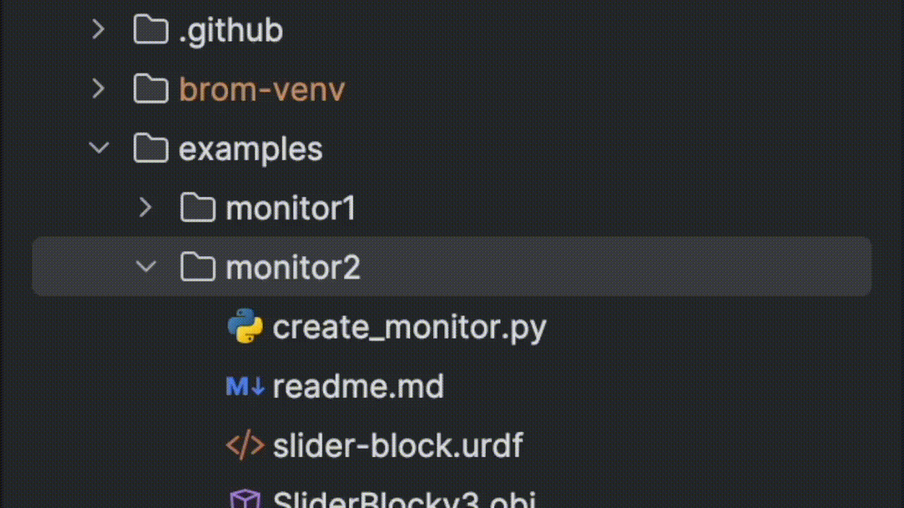

DiagramWatcher
==============

*Easily "watch" all of the systems in your Drake simulation using the* 
:py:class:`DiagramWatcher<brom_drake.DiagramWatcher.DiagramWatcher.DiagramWatcher>`
*!*

Summary
-------

The :py:class:`DiagramWatcher<brom_drake.DiagramWatcher.DiagramWatcher.DiagramWatcher>` is a class that can be used to easily log and plot data in a Drake simulation.

Example Usage
-------------

A full example is shown in the :code:`examples/watcher` directory of the repository, but a partial example snippet is:

.. code-block:: python

    def main():

        # Building Diagram
        time_step = 1e-3
        builder = DiagramBuilder()

        # Add your systems here...

        # Add Watcher and Build
        watcher, diagram, diagram_context = add_watcher_and_build(
            builder,
            plot_arrangement=PortFigureArrangement.OnePlotPerDim,
            figure_naming_convention=FigureNamingConvention.kHierarchical,
            file_format="svg",
        )

That's it! Whenever the program ends, the DiagramWatcher will:

- Save the raw data of the signals produced by your simulation over time in the DiagramWatcher's :code:`raw_data` directory, and
- Plot the signal data in figures, for all of the signals that the DiagramWatcher can find*.

*By "all of the signals that the DiagramWatcher can find", we do not mean all of the signals in your simulation. 

The DiagramWatcher will only log signals in the diagram that:

- Come from :code:`kVectorValued` output ports,
- Come from :code:`AbstractValue` output ports whose underlying type is
  + :code:`RigidTransform`,
  + :code:`bool`, or
  + :code:`list[T]` where :code:`T` is one of the above types (i.e., :code:`RigidTransform`, :code:`bool`, etc.).

To learn more about this type, read about the `PortDataType`_ and `OutputPort`_ objects in Drake's documentation.

.. _PortDataType: https://drake.mit.edu/pydrake/pydrake.systems.framework.html?highlight=vectorvalued#pydrake.systems.framework.PortDataType
.. _OutputPort: https://drake.mit.edu/pydrake/pydrake.systems.framework.html#pydrake.systems.framework.OutputPort

Easily Log Your Diagram's Signals
^^^^^^^^^^^^^^^^^^^^^^^^^^^^^^^^^

It is recommended that you use the convenience function :py:function:`add_watcher_and_build<brom_drake.utils.watcher.add_watcher.add_watcher_and_build>` to add a
:py:class:`DiagramWatcher<brom_drake.DiagramWatcher.DiagramWatcher.DiagramWatcher>` to your diagram.

.. code-block:: python

    # Drake imports
    from pydrake.all import (
        DiagramBuilder, Simulator,
    )
    # All your other imports

    from brom_drake.all import add_watcher_and_build

    # Create a diagram builder
    builder = DiagramBuilder()

    # Add and connect your systems...

    # Add the watcher and build the diagram
    watcher, diagram, diagram_context = add_watcher_and_build(builder)

    # Set up simulation
    simulator = Simulator(diagram, diagram_context)
    simulator.set_target_realtime_rate(1.0)
    simulator.set_publish_every_time_step(False)

    # Run simulation
    simulator.Initialize()
    simulator.AdvanceTo(15.0)

What will happen whenever you use this function is that:

- The :py:class:`DiagramWatcher<brom_drake.DiagramWatcher.DiagramWatcher.DiagramWatcher>` will be created.
    - It will search through all systems that the :code:`DiagramBuilder` has added.
    - For each system, the watcher will add a :code:`VectorLogger` to each output port that is a :code:`kVectorValued` port.
    - The :py:class:`DiagramWatcher<brom_drake.DiagramWatcher.DiagramWatcher.DiagramWatcher>` will connect all loggers to all targeted ports (in the above case, we will target all available output ports).
- After the simulation is run and the script completes, the watcher will save all data traces for each port in .png files. These plots will be in a new :code:`brom` directory.

Watching Specific systems
^^^^^^^^^^^^^^^^^^^^^^^^^

If you only want to watch a specific system, then you can do so by passing in information to the "targets" argument:

.. code-block:: python

    watcher, _, _ = add_watcher_and_build(
        builder,
        targets=[
            ("system_name", "port_name"),
            "system_name2",
        ],
    )

The above code tells the watcher to watch the port named port_name on the system named system_name. (If you don't know your system's name in Drake, then you can usually find it by using the :code:`get_name()` method.)