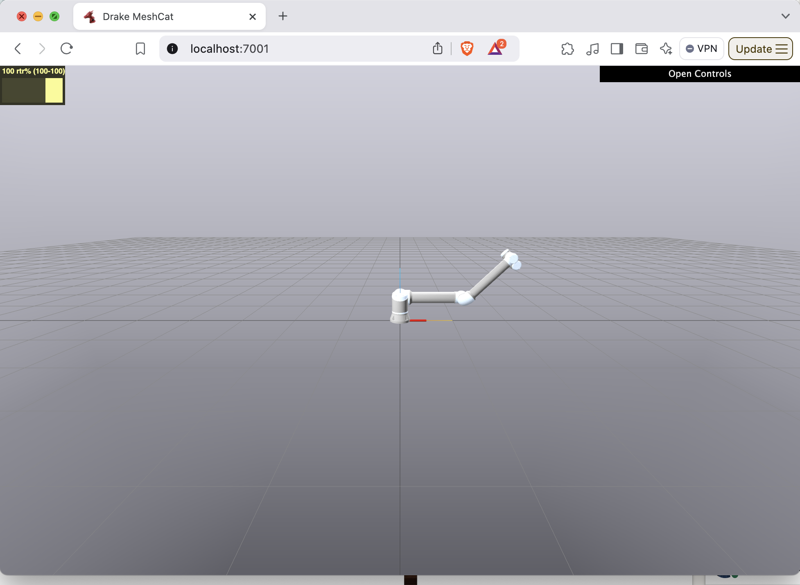

Show Me This Model
==================

*Easily show a specific model (robot or object) in a Drake simulation using the*
:py:class:`~brom_drake.productions.debug.show_me.show_me_this_model.ShowMeThisModel`
*!*

Introduction
------------

Picture this: You've just started to use Drake and want to show how your favorite URDF looks inside of the Drake simulator at a certain joint configuration. How do you do this?

The answer is often: "It's complicated."

That's why we created :py:class:`~brom_drake.productions.debug.show_me.show_me_this_model.ShowMeThisModel`.
You can share your robot model and (optionally) a desired joint configuration with this object and it will make it super simple to accomplish your mission!

You might find it helpful when debugging new robot models.

Example Usage
-------------

You can view multiple examples for this :code:`Production` object in our ``examples/productions/helpful_for_debugging/show_me_this_model`` directory. 
In the following section, we will also include one example to demonstrate how to use ShowMeThisModel.

.. code-block:: python

    from importlib import resources as impresources
    import numpy as np
    from pydrake.systems.analysis import Simulator

    #Internal imports
    from brom_drake import robots
    from brom_drake.all import drakeify_my_urdf
    from brom_drake.scenes import ShowMeThisModel

    def main():
        # Setup
        urdf_file_path = str(
            impresources.files(robots) / "models/ur/ur10e.urdf"
        )

        # Convert the URDF into a format that Drake likes
        new_urdf_path = drakeify_my_urdf(
            urdf_file_path,
            overwrite_old_logs=True,
            log_file_name="drakeify-my-urdf1.log",
        )

        # Visualize the URDF using the "show-me-this-model" feature
        time_step = 1e-3
        production = ShowMeThisModel(
            str(new_urdf_path),
            with_these_joint_positions=[0.0, 0.0, -np.pi/4.0, 0.0, 0.0, 0.0],
            time_step=time_step,
        )

        # Build Diagram
        diagram, diagram_context = production.add_cast_and_build()

        # Set up simulation
        simulator = Simulator(diagram, diagram_context)
        simulator.set_target_realtime_rate(1.0)
        simulator.set_publish_every_time_step(False)

        # Run simulation
        simulator.Initialize()
        simulator.AdvanceTo(15.0)

    if __name__ == "__main__":
        main()

The result of this script will be the following simulation:

How it works
^^^^^^^^^^^^

In the above snippet, we see a couple of things:

- The inputs to the Production are:
  - path_to_model: (Required) A string describing the location of the URDF (or other model) that you want to visualize.
  - with_these_joint_positions: (Optional) A list describing what position you want each joint to be in.
  - time_step: (Optional) The time step to use in the MultibodyPlant created internally in this Production.
- Once the production is created we can use the normal workflow (i.e., build the Production and then use the resulting Diagram object in your simulation) to view the robot in the desired joint configuration.

.. note::

    (For advanced users of Drake) You can add other elements to the scene besides the robot specified by :code:`path_to_model`.
    After creating the ShowMeThisModel object, you will be able to add additional items to its MultibodyPlant (it is saved in production.plant) and those additional items will appear in the simulation as well. This can be especially helpful if you're trying to observe whether or not a robot is in collision with an object when it is in the configuration with_these_joint_positions.

Showing Collision Geometries
----------------------------

Another helpful feature of ShowMeThisModel is the ability to show the collision geometry of the URDF that you're interested in.

This can be especially helpful if you have over-approximating cylinders or pill shapes that are meant to act as your collision geometries.
If the collision geometry is very different from the visual geometry, then you may want to use this feature to double-check what the collision geometry looks like in a given configuration.

You can enable this feature by setting the :code:`show_collision_geometries` argument to :code:`True` when creating the ShowMeThisModel object:

.. code-block:: python

    production = ShowMeThisModel(
        str(new_urdf_path),
        with_these_joint_positions=[0.0, 0.0, -np.pi/4.0, 0.0, 0.0, 0.0],
        time_step=time_step,
        show_collision_geometries=True,
    )

Which will produce the following simulation result for the UR10e robot:

.. image:: ../../../_static/images/productions/debug/show_me_this_model/collision_geometries1.png
    :alt: A UR10e robot arm in an empty simulated environment, in a "bent-elbow" configuration, showing the collision geometries instead of the visual geometries. The collision geometries are a set of odd cylinders around each link.
    :align: center